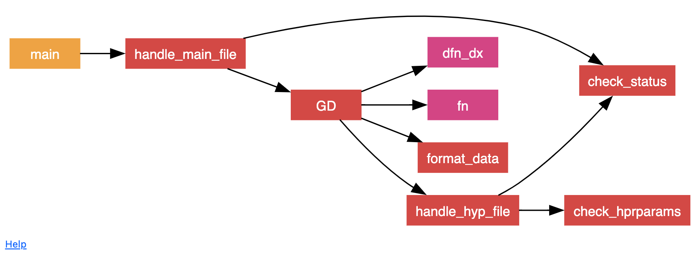

# Basic Optimization Framework - FORTRAN 90

Small project for learning modern FORTRAN 90 and studying optimization concepts. This project is a generic framework over which simple optimization methods can be built upon and run.

> NOTE: this project is finished.

The main documentation page (which can now be found [here](https://antoniorochaaz.github.io/Basic-Optimization-Framework---FORTRAN-90/)) contains information about how the code works and how to use it. The end of the page "Procedures" also has an interactive graph showing the subroutine call structure.

## Compilation

A makefile is provided for compilation. `.o `and `.mod` files are generated into the `objs` folder.

## Documentation

The documentation was done with [FORD](https://github.com/Fortran-FOSS-Programmers/ford). It can be run with ``make documentation`` or
simply ``ford doc/doc.md``. The results are generated into the ``doc/doc`` folder.

## TODOs 
- Could add a reporting subroutine